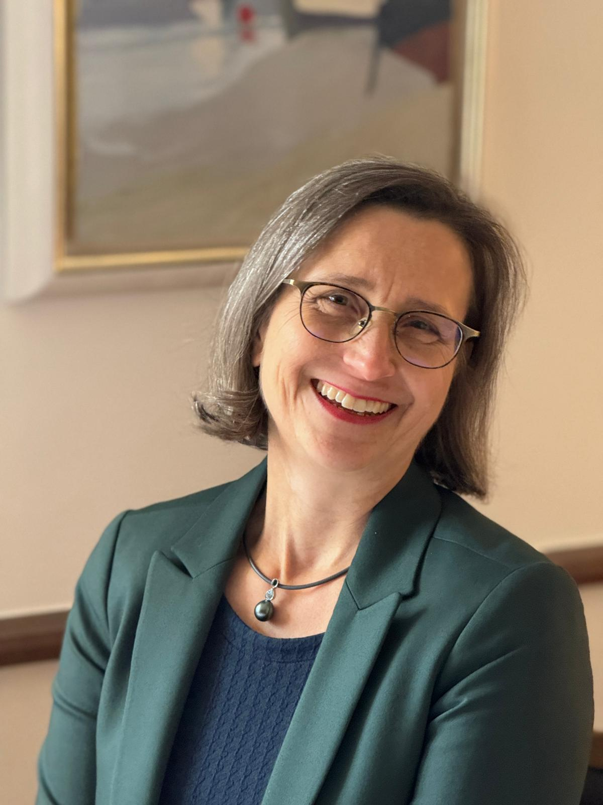

 

**Inhalt**  
- [My Story](#my-story)  
- [Mein Leben/meine Ausbildungen](#mein-leben--meine-ausbildungen)

## My Story  

*"Ich weiss aus eigener Erfahrung, dass mein Leben freudvoller und widerstandsloser wird, je besser ich mich selbst kenne und lerne, meine Entscheide auf meine ganz individuelle Art zu fällen. Sowohl privat als auch beruflich bin ich erfolgreicher, wenn ich meine persönlichen Erfolgsschlüssel kenne und anwende. In meinen Erfolgsschlüsseln liegt auch das Wissen über den erfolgreichen Umgang in meinen Beziehungen, sei es in der Familie, im Freundeskreis oder mit meinen Geschäftspartnerinnen und -partnern, meinen Kundinnen und Kunden und meinen Mitarbeitenden."*

Mein Herzblut schlägt seit meiner Kindheit für das Erkennen und Begleiten von Menschen. Aufgewachsen zusammen mit drei Geschwistern, liebte ich es bereits damals, herauszufinden, wie unterschiedlich jede*r war und was er/sie brauchte.  
Als Betriebsökonomin FH in Führungspositionen im Gesundheits- und Sozialwesen lag es mir immer am Herzen zu erkennen, welche Mitarbeitenden sowohl für sich selbst als auch für den Betrieb «am richtigen Platz» waren. Später ging das Managen als Familienfrau mit drei Kindern weiter. Im Anwenden der persönlichen Erfolgsschlüssel bei unseren heranwachsenden Kindern erlebte ich sehr viel Erleichterung in der Erziehungsarbeit. Mehrheitlich in der Schweiz lebend, verhalfen mir zwei Auslandaufenthalte – in den USA und England – zu einer offenen Weltsicht und neuen Sichtweisen, wie man Dinge auch anders als gewohnt anpacken kann.
Ein Führungs-Coaching im Jahr 2003 – damals bereits auf der Grundlage des Human Design-Wissens – öffnete mir die Augen für mein eigenes Leben. Im Kennenlernen und Anwenden meiner persönlichen Erfolgsschlüssel wurde mein Leben widerstandsloser und freudvoller. Zu wissen, wo und wie ich am besten entscheide, verhalf mir zu besserer Gesundheit und zu mehr Erfolg und Zufriedenheit. 

Seit 2016 bin ich zertifizierte Human Design Persönlichkeits- und Partnerschaftsberaterin mit Zusatzdiplomen in Kinderanalyse, Gesundheit und Psychologie und holistische Beraterin und seit 2021 zertifizierte BG5© Career & Business Consultant. 
Das Beratungs-Tool aus Human Design System- und BG5© beinhalten aus meiner Sicht vor allem drei grosse «Schätze»: 
> 1. Die persönlichen Erfolgsschlüssel, welche aufzeigen, wer ich bin und wie es für mich am gesündesten ist, Entscheidungen zu treffen.   
> 2. Die Möglichkeit, __verborgene Beziehungs-Dynamiken__ in Partnerschaften und Gruppen (z.B. in der Familie und in Teams) __sichtbar__ zu machen. Dort, wo oftmals Konflikte entstehen, die das Zusammensein und Arbeiten unnötig erschweren.   
> 3. Die Möglichkeit, jede Person mit individueller und holistischer Sichtweise zu coachen inklusive Einbezug von persönlichen, körperlichen und mentalen Gesundheits-Themen.

***Als geübte Fragestellerin, aufmerksame Beobachterin und Coach freue ich mich, dein Leben, Arbeiten und Führen zu vereinfachen und verbessern***  

   

## Mein Leben / meine Ausbildungen

geboren 1966 in Zürich  
aufgewachsen in Felben-Wellhausen, TG, Schweiz
 

### Tätigkeiten und Ausbildungen 
- Fundierte Führungsausbildung: Betriebsökonomin FH, Facility Management  
- Über 10 Jahre Führungserfahrung in grossen, mittleren und kleinen Unternehmen und Institutionen  
- Laufende Weiterbildungen in Kommunikation   Spezialisierung: Beziehungs- und Konfliktmanagement (Gordon, Glasl)
- CAS WBB an der Executive School   St. Gallen: Women Back to Business

> 1. **Persönlichkeitsberaterin**   "Human Design Professional" für Einzel-, Partnerschafts- und Elternberatung  
> 2. **Karriere- und Businessberaterin**</h4>   BG5 Career & Business Consultant

- Familien-Management:   3 Kinder Jahrgänge 1998, 2000, 2002
- Auslandaufenthalte:   1 Jahr USA, 1997/1998   2 Jahre England, 2006-2008
- Behördentätigkeiten

(vorlieben würde ich weglassen, was meinst du?)
### Vorlieben
Als geübte Fragestellerin, aufmerksame Beobachterin und Coach freue ich mich, Arbeiten, Führen und Leben zu vereinfachen und verbessern.  
  
Besonders gerne analysiere ich den persönlichen Umgang aller Mitarbeitenden untereinander - dort wo am meisten Konflikte entstehen -. Ich liebe es, Betriebsprozesse auf meine individuelle und pragmatische Art zu analysieren - unter Einbezug aller gesammelter Führungserfahrungen und meinem fundierten Fachwissen.  
  
Ich geniesse es, gemeinsam mit Ihnen umsetzbare Verbesserungen zu erarbeiten. Und am schönsten für mich ist es, wenn Sie Ihr Ziel erreichen, dass Sie einen klaren Return on Investment erhalten, indem Sie produktiver arbeiten, besser führen und Ihre Teams mehr erreichen werden.  
  
Als Ausgleich geniesse ich zwischendurch Zeit für mich und bevorzuge sonnige, warme Plätze sowie das Meer.  
  
Nicht zuletzt schöpfe ich viel Kraft und Energie in meiner Familie.